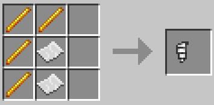
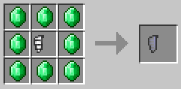
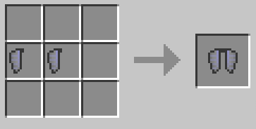

Mod homepage is [https://minecraft.curseforge.com/projects/survival-recipes][0].

Recipes
=======

Saddle
------

    X#X
    XXX
    #Y#

`X` = *leather*, `Y` = *iron ingot*

Elytra base
-----------

    XX#
    XY#
    XY#

`X` = *blaze rod*, `Y` = *paper*

Elytra part
-----------

    XXX
    XYX
    XXX

`X` = *emerald*, `Y` = *elytra base*

Elytra
------

    XX

`X` = *elytra part*

Name tag
--------
    ##Y
    #Z#
    X##

`X` = *iron ingot*, `Y` = *string*, `Z` = *leather*

Smelting
========

* 1 *rotten flesh* = *leather*

[0]: https://minecraft.curseforge.com/projects/survival-recipes
